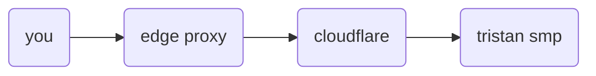

> **Warning**: No longer maintained due to TSMP not being home hosted anymore and instead hosted in the cloud courtesy of GCP.

# edge-proxy

In production we have a tiny DO droplet running the edge proxy. The sub-domain `mc.tristansmp.com` points to it, there's also a SRV record that allows you to also connect via `tristansmp.com`.
